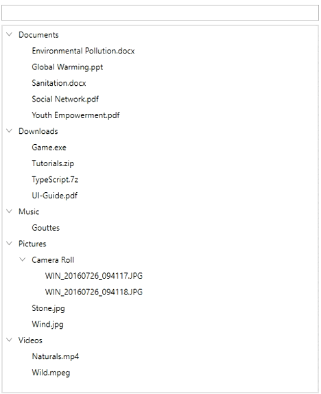

# How to apply filters in wpf treeview using collectionview type sources?

## About the sample

This example describes how to apply filters in wpf treeview using collectionview type sources.

[WPF TreeView](https://www.syncfusion.com/wpf-controls/treeview) (SfTreeView) allows to apply filters using [ListCollectionView](https://docs.microsoft.com/en-us/dotnet/api/system.windows.data.listcollectionview?view=windowsdesktop-6.0) and [CollectionView](https://docs.microsoft.com/en-us/dotnet/api/system.windows.data.collectionview?view=windowsdesktop-6.0).

``` XML

 <Window.DataContext>
        <local:FileManagerViewModel/>
    </Window.DataContext>

        <Grid >
            <Grid.RowDefinitions>
                <RowDefinition Height="30"/>
                <RowDefinition Height="*"/>
            </Grid.RowDefinitions>
            <!--Filter applied to the SfTreeView based on the text typed in this TextBox.-->
            <TextBox x:Name="TextBox" Width="475" BorderThickness="1" Padding="2,0,2,0" Text="{Binding FilterText, UpdateSourceTrigger=PropertyChanged}" Margin="0,3,0,3" />
            <syncfusion:SfTreeView
            Grid.Row="1"
            Width="475"
            Height="550"
            x:Name="treeView"
            BorderThickness="2"
            BorderBrush="LightGray"
            AutoExpandMode="AllNodes"
            FocusVisualStyle="{x:Null}"
            IsAnimationEnabled="True"
            ItemsSource="{Binding CollectionView}"
            ChildPropertyName="SubFiles">
                <syncfusion:SfTreeView.ItemTemplate>
                    <DataTemplate>
                        <Grid>
                            <TextBlock VerticalAlignment="Center"
                               Text="{Binding FileName}" />
                        </Grid>
                    </DataTemplate>
                </syncfusion:SfTreeView.ItemTemplate>
                <!--Using the SfTreeView loaded event hooks the OnFilterChanged method.-->
                <behavior:Interaction.Triggers>
                    <behavior:EventTrigger EventName="Loaded">
                        <local:TreeViewFilterTrigger/>
                    </behavior:EventTrigger>
                </behavior:Interaction.Triggers>
            </syncfusion:SfTreeView>
        </Grid>
</Window>

```

``` C#

 public class FileManagerViewModel : NotificationObject
    {
        #region Fields

        private ObservableCollection<FileManager> imageNodeInfo;

        public ListCollectionView CollectionView { get; set; }

        public object Item { get; set; }
        #endregion

        #region Constructor

        public FileManagerViewModel()
        {
            GenerateSource();
            CollectionView = new ListCollectionView(ImageNodeInfo);
        }

        #endregion

        #region Filtering
        internal delegate void FilterChanged();
        internal FilterChanged filterChanged;

        private string filterText = string.Empty;

        public string FilterText
        {
            get { return filterText; }
            set
            {
                filterText = value;
                if (filterChanged != null)
                    filterChanged();
                RaisePropertyChanged("FilterText");
            }
        }

        #endregion

        #region Properties

        public ObservableCollection<FileManager> ImageNodeInfo
        {
            get { return imageNodeInfo; }
            set { this.imageNodeInfo = value; }
        }


        #endregion
    }

     /// <summary>
    /// Represents a class that used to trigger filter action for SfTeeView.
    /// </summary>
    public class TreeViewFilterTrigger : TargetedTriggerAction<SfTreeView>
    {
        /// <summary>
        /// Method used to hook the filter method when the SfTreeView is Loaded.
        /// </summary>
        /// <param name="parameter"></param>
        protected override void Invoke(object parameter)
        {
            var viewModel = this.Target.DataContext as FileManagerViewModel;
            viewModel.filterChanged += OnFilterChanged;
        }

        /// <summary>
        /// Method to filter the data.
        /// </summary>
        private void OnFilterChanged()
        {
            var viewModel = this.Target.DataContext as FileManagerViewModel;
            viewModel.CollectionView.Filter = (e) =>
            {
                FileManager file = e as FileManager;
                if ((file.FileName.ToLower()).Contains(viewModel.FilterText.ToLower()))
                    return true;
                if (file.SubFiles != null)
                {
                    foreach (var subFile in file.SubFiles)
                    {
                        if (subFile.FileName.ToLower().Contains(viewModel.FilterText.ToLower()))
                            return true;
                        if (subFile.SubFiles != null)
                            foreach (var sub in subFile.SubFiles)
                                if (sub.FileName.ToLower().Contains(viewModel.FilterText.ToLower()))
                                    return true;
                    }
                }
                return false;
            };
            this.Target.ExpandAll();

        }
    }

```



View sample in [github](https://github.com/SyncfusionExamples/How-to-apply-filters-in-wpf-treeview-using-collectionview-type-sources).